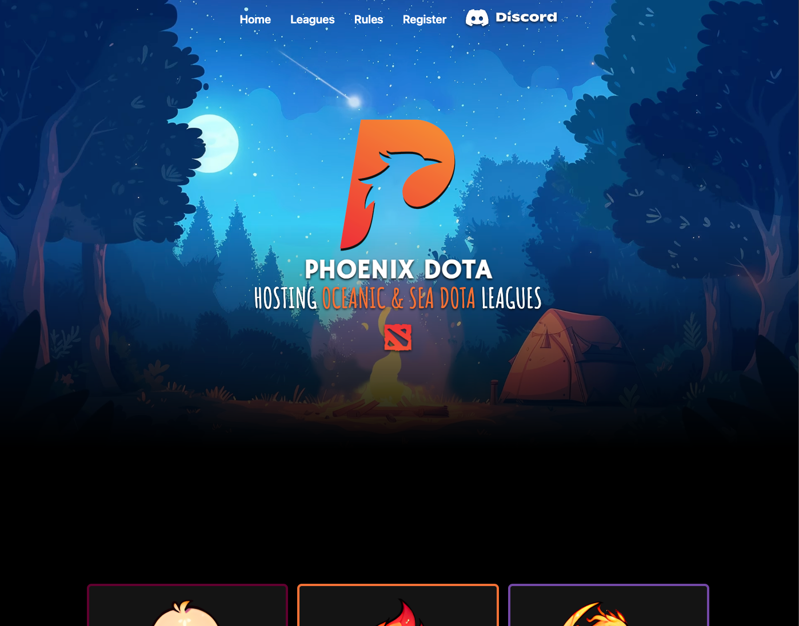

# [Phoenix Dota](https://phoenixdota.kyledlong.com)

Welcome to Phoenix Dota! This repository hosts the landing page for the Phoenix Dota community. Our goal is to create a central hub where players can connect, join our Discord community, and stay updated with the latest tournament statistics.
<br>




## Tech

|                   |
| ----------------- | 
| React             | 
| Tailwind          | 
| Cloud functions   | 
| Google sheets     | 
| Cloud flare pages | 


## How to Use
<br>

1. Clone the repository:

```bash
git clone https://github.com/KD-Long/phoenixdota.git
```

2. Install the dependencies:

```bash
cd phoenixdota
npm install
```

3. Run the project:

```bash
npm run dev
```

3. Open your web browser and navigate to http://localhost:5173


